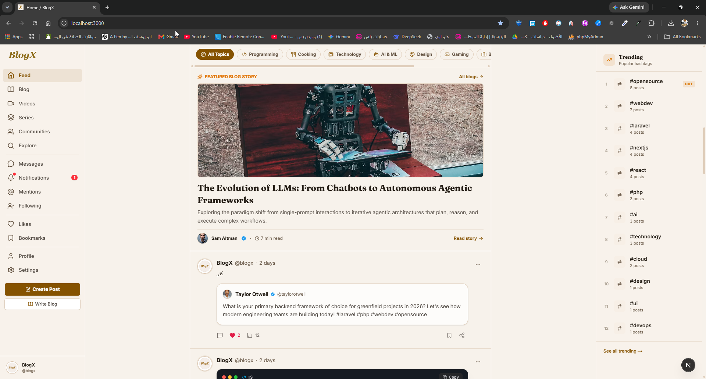
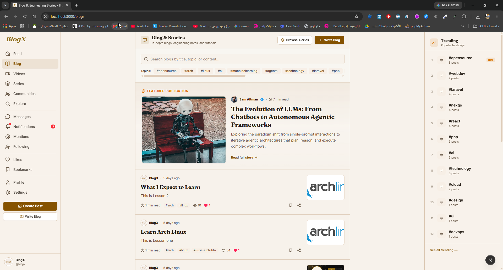
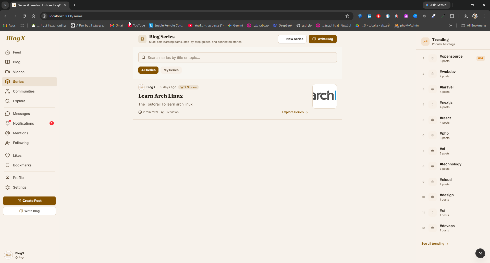
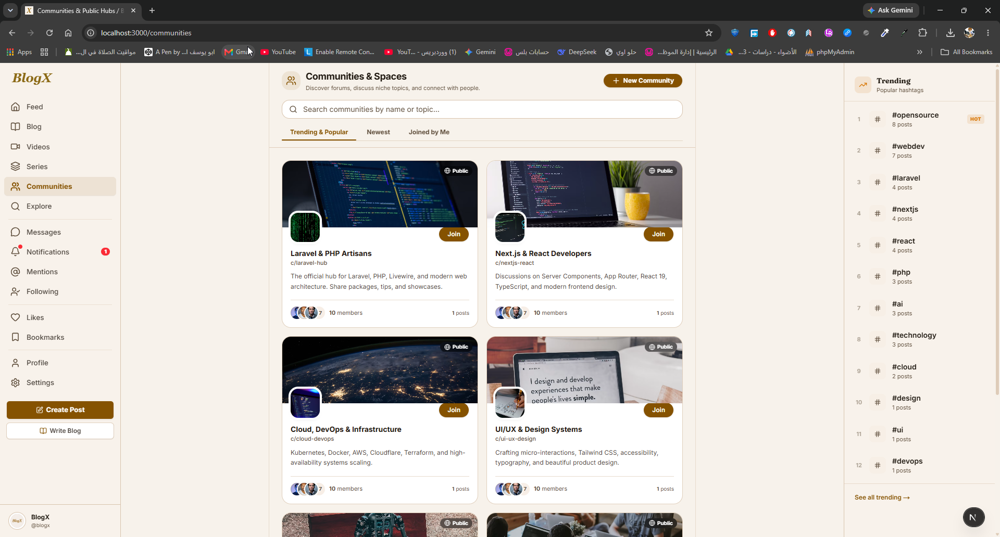
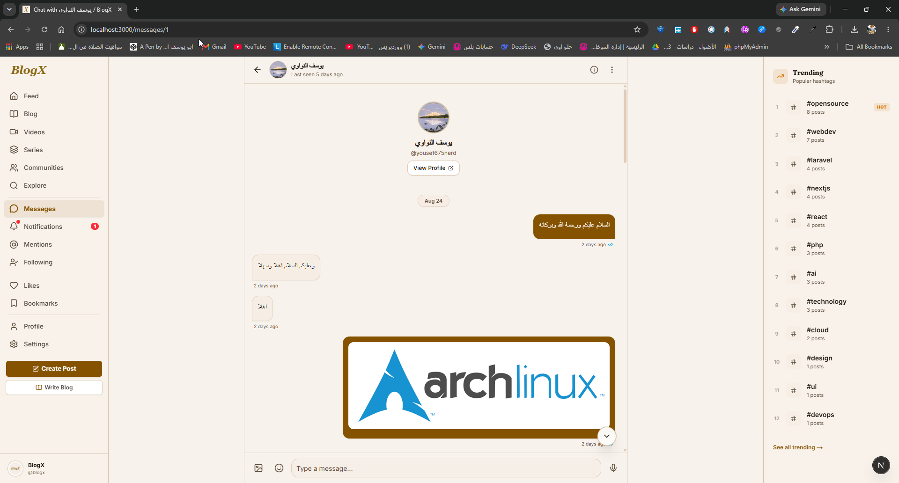
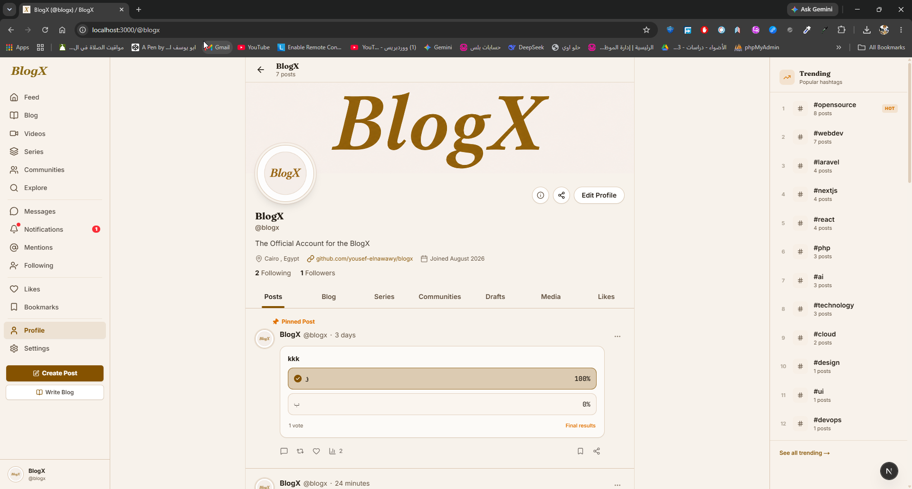
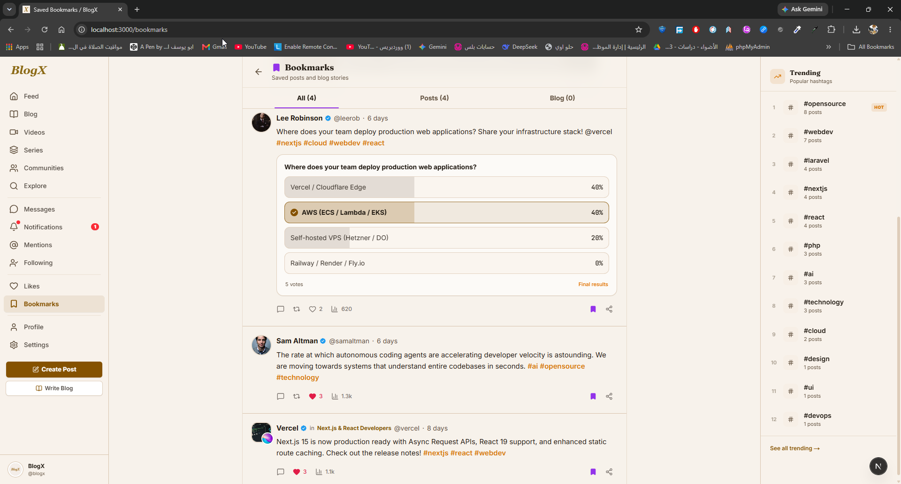

<p align="center">
  
</p>

<h1 align="center">BlogX</h1>

<p align="center">
  A full-stack modern social blogging & publishing platform for creators, writers, and communities.
</p>

<p align="center">
  
  
  
  
  
  
  
  
</p>

---

## Overview

**BlogX** is an all-in-one publishing and social interaction platform tailored for writers, creators, and online communities. It brings together long-form blogging, series curation, quick social posts, interactive polls, real-time messaging, and community hubs under a sleek, responsive user interface.

The repository is structured into two decoupled applications:

* **Backend** — Laravel 13 REST API with Laravel Sanctum authentication, Laravel Reverb WebSockets for real-time communication, MySQL database, and modular services.
* **Frontend** — Next.js 16 (App Router) client with React 19, TypeScript, Tailwind CSS 4, Motion & GSAP animations, shadcn/ui components, and real-time event broadcasting via Laravel Echo.

---

## Screenshots

Selected views from the BlogX platform:

### 1. Feed & Posts
<p align="center">
  
</p>

### 2. Long-form Blogs & Articles
<p align="center">
  
</p>

### 3. Multi-part Series
<p align="center">
  
</p>

### 4. Community Spaces
<p align="center">
  
</p>

### 5. Real-Time Chat & Direct Messaging
<p align="center">
  
</p>

### 6. User Profile & Badges
<p align="center">
  
</p>

### 7. Bookmarks & Saved Content
<p align="center">
  
</p>

---

## Key Features

### 🔐 Authentication & Account Security
* **Email & Password Authentication**: Registration, login, and secure password hashing.
* **OAuth 2.0 Integration**: Sign in with Google (via Laravel Socialite).
* **Two-Factor Authentication (2FA)**: TOTP authenticator app support with QR code scanning and downloadable recovery codes.
* **Email Verification**: Automatic verification mailers and token validation.
* **Session & Device Management**: View active login sessions/devices and revoke sessions remotely.

### ✍️ Publishing & Content Types
* **Social Posts**: Rich posts with image compression, video uploads with automatic client-side thumbnail generation, mentions (`@username`), and hashtags (`#tag`).
* **Interactive Polls**: Create single/multi-choice polls with live vote percentages.
* **Long-Form Blogs**: Dedicated blogging section with featured articles, topic categorizations, estimated reading time, and drafts management.
* **Curated Series**: Group sequential articles into ordered multi-chapter reading series.
* **Media & Videos**: Dedicated video feed, media lightboxes (`yet-another-react-lightbox`), and image viewing.
* **Post Actions**: Likes, Reposts, Quote posts, Bookmarks, and Scheduled posts.
* **Impressions & Analytics**: Automatic tracking of single and batch post impressions.

### 👥 Communities & Social Interactions
* **Community Hubs**: Create custom communities with moderation, member roles, and public/private join requests.
* **Following Feed**: Personalized feed strictly for creators and friends you follow.
* **Suggestions & Discovery**: Recommended creators and trending topics algorithm.
* **Comments & Nested Interactions**: Full commenting system with comment likes.
* **User Badges & Profiles**: Verified badges, customizable bios, cover headers, and activity logs.

### 💬 Real-Time Messaging & Chat
* **Direct Messaging (DM)**: 1-on-1 private encrypted chat conversations.
* **Powered by WebSockets**: Instant delivery via **Laravel Reverb** and **Laravel Echo**.
* **Chat Features**: Live typing indicators, read receipts, message reactions, message editing, message deletion, pinned messages, starred messages, contact nicknames, and media gallery.

### 🔔 Notifications
* Real-time notifications powered by Reverb WebSockets (with polling fallback).
* Granular notification preferences for likes, comments, mentions, follows, and messages.
* Read/unread counters and one-click "Mark all as read".

### 🛡️ Administration & Verification
* Identity verification request submissions with document upload.
* Admin panel to review, approve, or reject verification badges.
* User management and status moderation.

---

## Tech Stack

### Backend
| Technology | Version | Purpose |
| :--- | :--- | :--- |
| **PHP** | `^8.3` | Core server runtime |
| **Laravel** | `^13.8` | Backend framework & REST API |
| **Laravel Sanctum** | `^4.0` | Secure token & SPA authentication |
| **Laravel Reverb** | `Latest` | High-performance WebSocket server |
| **Laravel Socialite** | `Latest` | Google OAuth authentication |
| **MySQL / SQLite** | `Latest` | Relational database storage |

### Frontend
| Technology | Version | Purpose |
| :--- | :--- | :--- |
| **Next.js** | `16.2.x` | React App Router framework & SSR/CSR |
| **React** | `19.2.x` | UI component library |
| **TypeScript** | `5.x` | Static typing & type safety |
| **Tailwind CSS** | `4.x` | Modern utility-first styling |
| **Motion** | `12.x` | Framer Motion animations |
| **GSAP** | `3.15.x` | High-performance interface animations |
| **Laravel Echo & Pusher-js** | `Latest` | Real-time WebSocket broadcasting client |
| **shadcn/ui & Base UI** | `Latest` | Accessible UI component primitives |
| **React Hook Form & Zod** | `Latest` | Form management and schema validation |
| **Axios** | `1.19.x` | API client with interceptors |
| **Sonner & Next-Themes** | `Latest` | Toast alerts and Dark/Light theme toggling |

---

## Project Structure

```text
BlogX/
├── backend/                        # Laravel 13 REST API
│   ├── app/
│   │   ├── Http/
│   │   │   └── Controllers/Api/   # API Controllers (Auth, Post, Blog, Chat, Admin, etc.)
│   │   ├── Models/                 # Eloquent Models (User, Post, Blog, Message, etc.)
│   │   ├── Notifications/          # Database & Broadcast Notifications
│   │   └── Services/               # Business logic & integrations
│   ├── database/
│   │   ├── migrations/             # Database Schema Migrations
│   │   └── seeders/                # Database Seeders
│   ├── routes/
│   │   ├── api.php                 # REST API Endpoints
│   │   ├── channels.php            # WebSocket Broadcast Channels
│   │   └── console.php             # Scheduled & CLI Tasks
│   └── composer.json
│
├── frontend/                       # Next.js 16 Application
│   ├── app/
│   │   ├── (auth)/                 # Login, Register, Forgot Password, 2FA
│   │   ├── (main)/                 # Feed, Blogs, Series, Chat, Communities, Profile, Videos
│   │   ├── api/                    # Next.js Route Handlers (e.g. oEmbed)
│   │   └── globals.css             # Tailwind CSS v4 design tokens
│   ├── components/                 # Reusable UI & Feature components
│   ├── contexts/                   # React Context Providers (Auth, Realtime, Theme)
│   ├── lib/                        # Axios instance, Echo client, image/video utilities
│   ├── services/                   # Frontend API services
│   └── package.json
│
└── screenshots/                    # Application UI Previews
```

---

## Getting Started

### Prerequisites

Ensure you have the following installed on your machine:
* **PHP** 8.3 or higher
* **Composer**
* **Node.js** 20 or higher & **npm**
* **MySQL** or **SQLite**

---

### 1. Backend Setup

1. Open a terminal and navigate to the `backend` directory:
   ```bash
   cd backend
   ```

2. Install PHP dependencies:
   ```bash
   composer install
   ```

3. Configure environment variables:
   ```bash
   cp .env.example .env
   ```

4. Generate the application encryption key:
   ```bash
   php artisan key:generate
   ```

5. Configure your database and Reverb credentials in `.env`:
   ```env
   APP_NAME=BlogX
   APP_URL=http://localhost:8000
   FRONTEND_URL=http://localhost:3000

   DB_CONNECTION=mysql
   DB_HOST=127.0.0.1
   DB_PORT=3306
   DB_DATABASE=blogx
   DB_USERNAME=root
   DB_PASSWORD=

   SANCTUM_STATEFUL_DOMAINS=localhost:3000
   SESSION_DOMAIN=localhost

   # Real-time WebSocket Server (Reverb)
   BROADCAST_CONNECTION=reverb
   REVERB_APP_ID=your_reverb_app_id
   REVERB_APP_KEY=your_reverb_app_key
   REVERB_APP_SECRET=your_reverb_app_secret
   REVERB_HOST="localhost"
   REVERB_PORT=8080
   REVERB_SCHEME=http

   # Google OAuth (Optional)
   GOOGLE_CLIENT_ID=your_google_client_id
   GOOGLE_CLIENT_SECRET=your_google_client_secret
   GOOGLE_REDIRECT_URI=http://localhost:8000/auth/google/callback
   ```

6. Run the database migrations (and seeders):
   ```bash
   php artisan migrate
   ```

7. Start the Laravel HTTP API server:
   ```bash
   php artisan serve
   ```
   *The API will run at `http://localhost:8000`.*

8. In a separate terminal, start the **Reverb WebSocket Server**:
   ```bash
   php artisan reverb:start
   ```
   *The WebSocket server will run at `ws://localhost:8080`.*

---

### 2. Frontend Setup

1. Open a new terminal and navigate to the `frontend` directory:
   ```bash
   cd frontend
   ```

2. Install npm dependencies:
   ```bash
   npm install
   ```

3. Create the `.env.local` file:
   ```env
   NEXT_PUBLIC_API_URL=http://localhost:8000
   NEXT_PUBLIC_REVERB_APP_KEY=your_reverb_app_key
   NEXT_PUBLIC_REVERB_HOST=localhost
   NEXT_PUBLIC_REVERB_PORT=8080
   NEXT_PUBLIC_REVERB_SCHEME=http
   ```

4. Start the Next.js development server:
   ```bash
   npm run dev
   ```

5. Open your browser and navigate to:
   ```text
   http://localhost:3000
   ```

---

## API Reference Overview

The backend exposes RESTful endpoints under the `/api` prefix.

### 🔑 Authentication & Security
| Method | Endpoint | Access | Description |
| :--- | :--- | :--- | :--- |
| `POST` | `/api/register` | Guest | Register a new user |
| `POST` | `/api/login` | Guest | Authenticate user |
| `POST` | `/api/auth/google/exchange` | Guest | Exchange Google OAuth credentials |
| `POST` | `/api/2fa/verify-login` | Guest | Verify TOTP code during login |
| `POST` | `/api/forgot-password` | Guest | Send password reset link |
| `POST` | `/api/reset-password` | Guest | Reset password with token |
| `POST` | `/api/logout` | Auth | Invalidate current session token |
| `POST` | `/api/logout-all` | Auth | Revoke all active session tokens |
| `GET` | `/api/user/devices` | Auth | List all active sessions/devices |
| `DELETE` | `/api/user/devices/{id}` | Auth | Revoke specific device session |
| `POST` | `/api/2fa/enable` | Auth | Generate 2FA secret and QR code |
| `POST` | `/api/2fa/confirm` | Auth | Confirm & activate 2FA |
| `POST` | `/api/2fa/disable` | Auth | Disable 2FA |

### 📝 Posts, Feed & Polls
| Method | Endpoint | Access | Description |
| :--- | :--- | :--- | :--- |
| `GET` | `/api/posts` | Public | List paginated posts feed |
| `POST` | `/api/posts` | Auth | Create a post (media, polls, tags) |
| `GET` | `/api/posts/{id}` | Public | Get single post details |
| `POST` | `/api/posts/{id}/update` | Auth | Update existing post |
| `DELETE` | `/api/posts/{id}` | Auth | Delete post |
| `POST` | `/api/posts/{id}/like` | Auth | Toggle post like |
| `POST` | `/api/posts/{id}/repost` | Auth | Toggle repost |
| `POST` | `/api/posts/{id}/quote` | Auth | Quote post with commentary |
| `POST` | `/api/posts/{id}/bookmark` | Auth | Bookmark/save post |
| `POST` | `/api/polls/{id}/vote` | Auth | Vote in a poll |
| `GET` | `/api/following/posts` | Auth | Feed of followed creators |
| `GET` | `/api/posts/videos` | Public | Video-only content feed |

### 📰 Blogs & Series
| Method | Endpoint | Access | Description |
| :--- | :--- | :--- | :--- |
| `GET` | `/api/blogs` | Public | List published blogs |
| `GET` | `/api/blogs/featured` | Public | List featured articles |
| `GET` | `/api/blogs/topics` | Public | List available blog categories |
| `GET` | `/api/blogs/{slugOrId}` | Public | View full blog article |
| `POST` | `/api/blogs` | Auth | Publish a new blog |
| `GET` | `/api/drafts` | Auth | List user's blog drafts |
| `GET` | `/api/series` | Public | List all multi-chapter series |
| `POST` | `/api/series` | Auth | Create a new series |

### 💬 Real-Time Messaging
| Method | Endpoint | Access | Description |
| :--- | :--- | :--- | :--- |
| `GET` | `/api/conversations` | Auth | List active direct conversations |
| `POST` | `/api/conversations/start` | Auth | Start or retrieve conversation |
| `GET` | `/api/conversations/{id}` | Auth | Get messages in conversation |
| `POST` | `/api/conversations/{id}/messages` | Auth | Send a message (broadcasts via Reverb) |
| `PUT` | `/api/messages/{id}` | Auth | Edit a sent message |
| `DELETE` | `/api/conversations/{id}/messages/{messageId}` | Auth | Delete a message |
| `POST` | `/api/conversations/{id}/messages/{messageId}/react` | Auth | Add/remove reaction |
| `POST` | `/api/conversations/{id}/typing` | Auth | Broadcast typing status |

### 👥 Communities
| Method | Endpoint | Access | Description |
| :--- | :--- | :--- | :--- |
| `GET` | `/api/communities` | Public | List explore communities |
| `GET` | `/api/communities/{slug}` | Public | Community overview and posts |
| `POST` | `/api/communities` | Auth | Create a new community |
| `POST` | `/api/communities/{id}/join` | Auth | Join or request to join |
| `POST` | `/api/communities/{id}/leave` | Auth | Leave community |

### 🔍 Search & Platform
| Method | Endpoint | Access | Description |
| :--- | :--- | :--- | :--- |
| `GET` | `/api/search` | Public | Search across posts, blogs, users, and tags |
| `GET` | `/api/hashtags/trending` | Public | List trending hashtags |
| `GET` | `/api/platform/stats` | Public | Overall platform statistics |

---

## License

This project is licensed under the **[MIT License](https://opensource.org/licenses/MIT)**.
